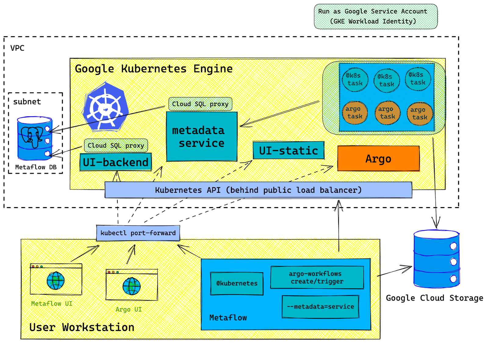

# Metaflow Infrastructure

This directory contains the GCP infrastructure and K8s services terraform for running [Metaflow](https://metaflow.org/).

The infrastructure and services we need to build are outlined below:


The repo currently has the following:
**Infra**
All the required infra has been implemented in Terraform.

**Services**
- Metadata Service, which is responsible for reading/writing information on flows (eg. status, artifacts) to a database (in this case a Cloud SQL Postgres DB). Metaflow automatically communicates with this during the execution of flows.

## Setup

To create the infrastructure in this repo, perform the following:

### Optional GCP Project Setup Steps

1. Go to Google Cloud Platform and create a project. Note that the resources offered in GCP's free tier are not sufficient. $300 free trial credits can be used however.
2. Search for the APIs and Services tab and enable the following APIs:
   - Cloud Resource Manager
   - Compute Engine API
   - Service Networking
   - Cloud SQL Admin API
   - Kubernetes Engine API
3. Install the `gcloud` cli and intialize it with the project following instructions [here](https://cloud.google.com/sdk/docs/install-sdk)
4. Install Terraform following instructions [here](https://developer.hashicorp.com/terraform/tutorials/aws-get-started/install-cli)
5. Install Kubectl (for managing/monitoring Kubernetes resources) following instructions [here](https://kubernetes.io/docs/tasks/tools/install-kubectl-macos/#install-with-homebrew-on-macos).
6. Create a Google Cloud Storage bucket on the console for storing the Terraform state. Note these for the next step.
7. In `main.tf`, change the bucket and prefix as desired for the Terraform state
8. Rename the `example.tfvars` file and set the variables.
9. Run `terraform init`


### Creating Infra and Services
1. Apply the infra:
```bash
terraform apply -target="module.infra" -var-file=FILE.tfvars
```

2. Apply the services:
```bash
terraform apply -target="module.services" -var-file=FILE.tfvars
```

## Changes from Outerbounds Template

This directory is heavily inspired by the template Outerbounds provide [here](https://github.com/outerbounds/metaflow-tools/tree/master/gcp/terraform). 

Below we list significant changes.

### Autopilot K8s Cluster
In GCP, the managed K8s offering has two types:

1. Standard: The typical deployment of K8s, which creates a cluster from manually managed node pools. Platform owners manage the nodes, specifying the types of nodes in these node pools and various constraints on them. If monitoring software is required to run in a pod on each node (eg. nvidia-smi), the platform owners will need to manually configure DaemonSets for this purpose. Billing is done based on the node pools, depending on the types of instances used.
2. Autopilot: GKE handles the management of nodes. Workloads then request to use a certain class of machines where Google configures. A noticeable gain of this approach for learning is that GKE handles the management of node pools. **In addition, billing is done based on the requested resources for workloads**.

This repo diverges from the template in that it uses autopilot instead of standard. As a result, some of the cluster configuration is different.
